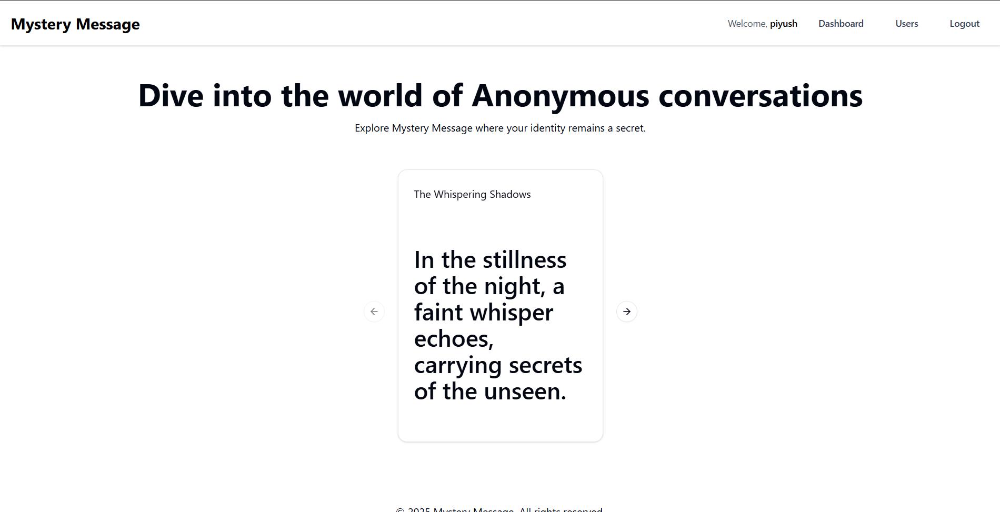
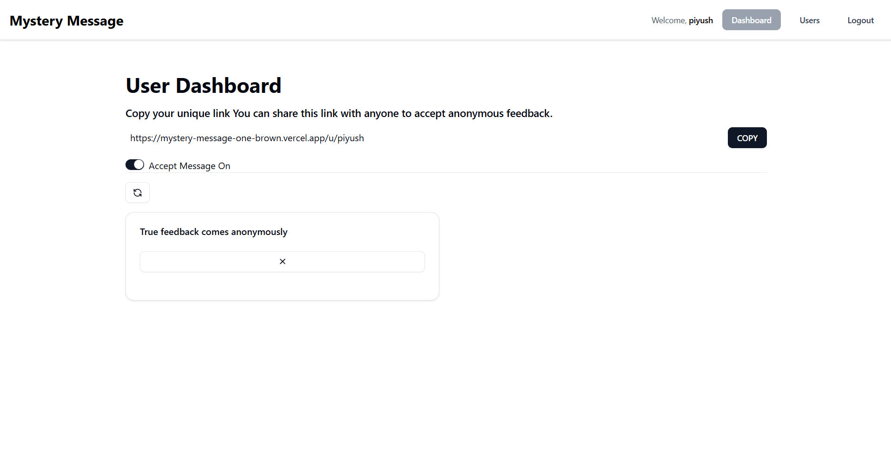
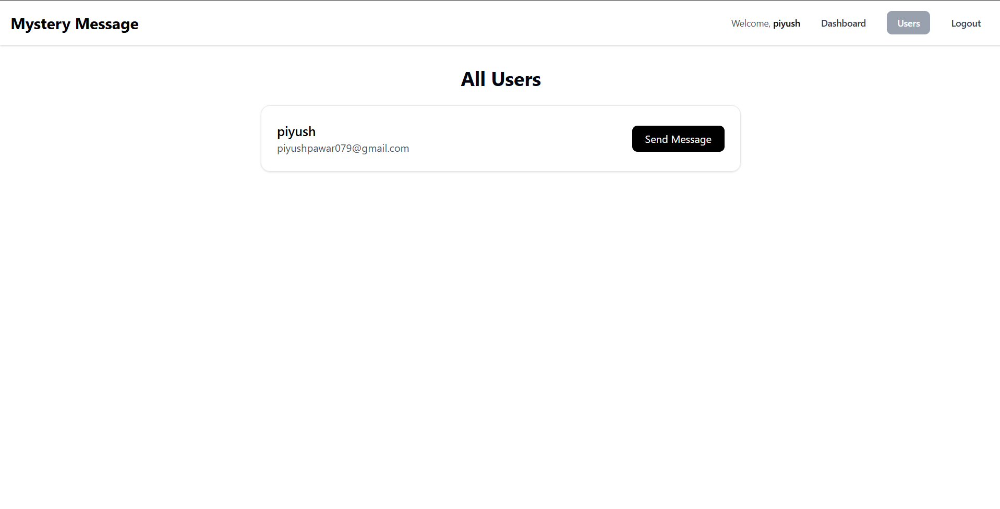
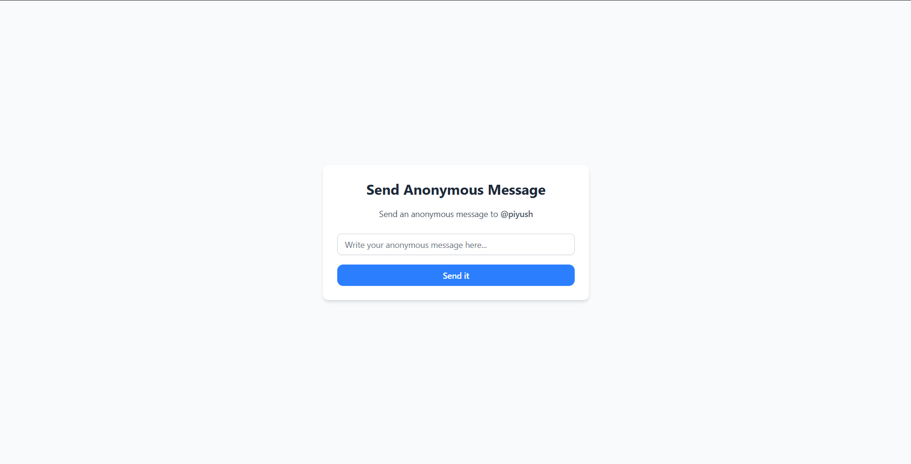

# **Live link of the website**

### https://mystery-message-one-brown.vercel.app/

# 🕵️ Mystery Message

A fun and anonymous feedback platform built with **Next.js**, **MongoDB**, and **NextAuth** where users can sign up, verify their email, and send or receive messages—completely anonymously.

## ✨ Features

- 🔐 **Email Authentication with Verification**
  - Users sign up using their email.
  - A **verification code** is sent using [Resend](https://resend.com/).
  - Verification code is valid for **2 hours**.
  - Users must verify their email to access the main dashboard.

- 🧑‍💻 **Secure Dashboard**
  - Authenticated and verified users are redirected to a personal dashboard.
  - View all anonymous messages received from other users.

- 📩 **Anonymous Messaging System**
  - Users can view all other users on the **Users** page.
  - Send completely anonymous messages to any user.
  - Sender identity is never revealed, encouraging honest and unfiltered feedback.

- 📬 **Email Delivery via Resend**
  - All emails, including verification emails, are sent using [Resend](https://resend.com/).

- 💾 **Tech Stack**
  - **Next.js (App Router)**
  - **MongoDB & Mongoose**
  - **NextAuth** for authentication
  - **ShadCN** for styling
  - **Resend** for email handling

---

## **⚡ Setup Instructions**  

0. Create a .env file using the .env.sample file

1. Clone the Repository  
    ```sh
    git clone https://github.com/piyushpawar079/Mystery_message.git
    cd Mystery_message
    ```

2. Start the frontend
    ```sh
    npm install  
    npm run dev 
    ```

3. Open in Browser
- Visit http://localhost:3000 to explore the website.

## ScreenShots

- 1. Home Page



- 2. Dashboard Page



- 3. Users Page



- 4. Send Message Page


